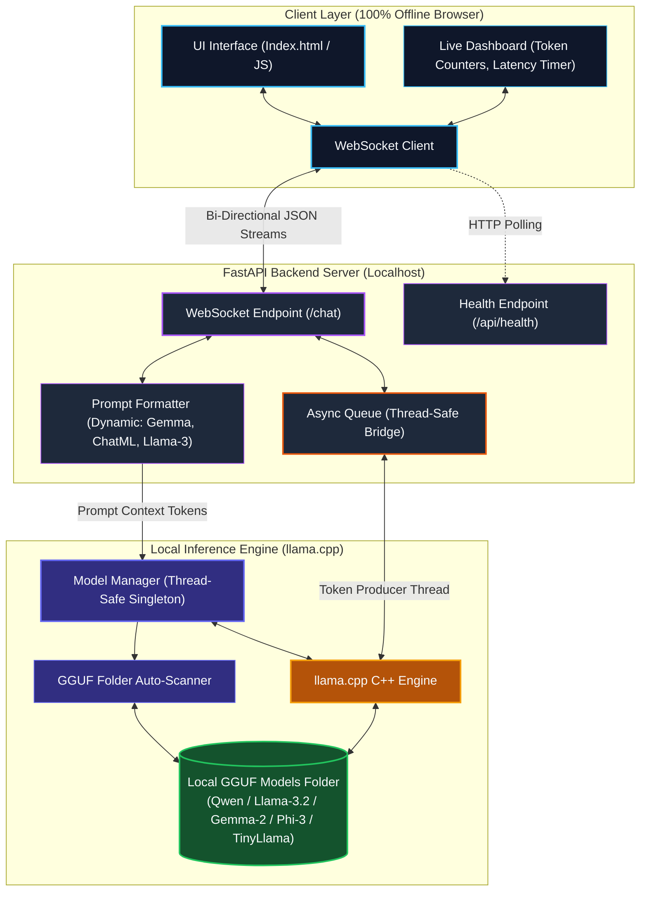

# 🦊 Fox AI: Private Local LLM Chatbot
> **Timeline:** Developed in September 2025 | Made public in July 2026

Fox AI is a lightweight, privacy-focused, 100% offline desktop-style AI chatbot. Powered by a Python FastAPI backend and `llama-cpp-python`, Fox AI loads and runs quantized GGUF models completely on-device. The application requires zero internet connection during inference and features a premium glassmorphic dark-themed UI.

---
 🔒 In-Memory Only Privacy Guarantee
> Fox AI stores nothing — all conversation data lives strictly in RAM and is permanently wiped when the app closes or the connection resets.**

*   No File Persistence: There are no databases (SQLite/PostgreSQL), no temporary JSON writes, and no disk caches.
*   WebSocket Scoping: Your chat history is maintained as a Python list scoped *exclusively* to the active WebSocket session.
*   Garbage Collection: Once your browser tab is closed, the connection terminates, or you click Wipe RAM, the Python list is dereferenced and immediately garbage-collected from the system memory.

---

## Key Features
*   **Zero-Build Frontend:** Written in pure Vanilla HTML, CSS, and JS. Served directly from the FastAPI server. No Node.js, `npm install`, or bundlers required.
*   **Local File & Code Analysis:** Supports attaching up to 5 files (up to 10MB each) like PDF, CSV, or code files. Parses and injects the context directly into the prompt stream offline.
*   **Local Image Generation:** Intercepts `/image [prompt]` to generate 512x512 images using a CPU-optimized Stable Diffusion (SD-Turbo) pipeline, with automated idle-unload memory reclamation.
*   **Singleton Model Architecture:** The GGUF model is loaded once as a thread-safe singleton on server startup, preventing memory-reload leaks and requests collision.
*   **Live Token Stats:** Measures and displays prompt tokens, generated tokens, and total session tokens in real time.
*   **Latency Tracking:** Computes and displays Time to First Token (TTFT) in milliseconds so you can easily profile hardware performance.
*   **Visual Excellence:** Premium responsive dark-mode styling with glassmorphism panels, glowing states, pulsing typing animations, and custom scroll areas.

---

Prerequisites
*   Python: Version 3.10 or higher.
*   Hardware (Recommended):** 8GB+ of system RAM.

---

 Step-by-Step Installation

 1. Clone the Repository
```bash
git clone https://github.com/Tejasgowdas-369/fox-ai.git
cd fox-ai
```

2. Install Python Dependencies
Create a virtual environment (highly recommended) and install requirements:
```bash
# Create and activate virtual environment
python -m venv venv
venv\Scripts\activate

# Install requirements
pip install -r backend/requirements.txt
```

> [!TIP]
> Windows GPU Acceleration (Optional):
> If you have an NVIDIA GPU, you can compile `llama-cpp-python` with CUDA support to offload weights and speed up inference significantly:
> ```powershell
> $env:CMAKE_ARGS="-DLLAMA_CUDA=on"
> pip install llama-cpp-python --force-reinstall --no-cache-dir
> ```

3. Download a GGUF Model
We have provided an interactive CLI download wizard to quickly install a model without leaving your terminal. Run the following command:
```bash
python download_model.py
```
You will be prompted to select from 5 high-quality, lightweight models (ranging from 660 MB to 2.2 GB). The script will download your choice with a live progress bar and place it directly into the `models/` directory.

Alternatively, you can manually download a model file and place it in the `models/` folder:

| Model Option | Repo Link | Filename | RAM Required |
| :--- | :--- | :--- | :--- |
| **Qwen 2.5 1.5B Instruct** | [Qwen/Qwen2.5-1.5B-Instruct-GGUF](https://huggingface.co/Qwen/Qwen2.5-1.5B-Instruct-GGUF) | `qwen2.5-1.5b-instruct-q4_k_m.gguf` | ~2.0 GB |
| **Gemma 2 2B Instruct** | [lmstudio-community/gemma-2-2b-it-GGUF](https://huggingface.co/lmstudio-community/gemma-2-2b-it-GGUF) | `gemma-2-2b-it-Q4_K_M.gguf` | ~3.0 GB |
| **Llama 3.2 3B Instruct** | [lmstudio-community/Llama-3.2-3B-Instruct-GGUF](https://huggingface.co/lmstudio-community/Llama-3.2-3B-Instruct-GGUF) | `Llama-3.2-3B-Instruct-Q4_K_M.gguf` | ~3.5 GB |
| **Phi 3 Mini 4K Instruct** | [microsoft/Phi-3-mini-4k-instruct-gguf](https://huggingface.co/microsoft/Phi-3-mini-4k-instruct-gguf) | `Phi-3-mini-4k-instruct-q4.gguf` | ~4.0 GB |
| **TinyLlama 1.1B Chat** | [TheBloke/TinyLlama-1.1B-Chat-v1.0-GGUF](https://huggingface.co/TheBloke/TinyLlama-1.1B-Chat-v1.0-GGUF) | `tinyllama-1.1b-chat-v1.0.Q4_K_M.gguf` | ~1.2 GB |

*The folder structure should look like:*
```
fox-ai/
├── backend/...
├── frontend/...
├── download_model.py
└── models/
    └── [your-selected-model].gguf   <-- Put model file here
```

4. Run the Application
Start the FastAPI server using Uvicorn. The server dynamically checks for the GGUF model and loads it:
```bash
python -m uvicorn backend.app.main:app --host 127.0.0.1 --port 8000
```
 5. Access the Interface
Open your web browser and navigate to:
```
http://127.0.0.1:8000
```
*(The frontend is served directly from uvicorn at the root path, meaning zero setup or port conflicts!)*

---
 How It Works (Local Architecture)



1.  WebSocket Handshake: On connecting to the frontend, a persistent WebSocket tunnel is established at `ws://127.0.0.1:8000/chat`.
2.  State Initialization: An empty list `chat_history = []` is initialized in RAM for that WebSocket.
3.  Prompt Tokenization When a user types a message, the backend concatenates previous context using a model-specific template (Gemma 2 or Phi-3) and tokenizes the result using `model.tokenize()` to calculate the exact prompt token count.
4.  Async Thread Execution:To prevent blocking the async event loop of FastAPI, the model's generator runs in a separate thread. Generated chunks are pushed to an async queue and streamed immediately to the client.
5.  Token Processing: The frontend calculates the time elapsed until the first token returns (Time-To-First-Token) and appends incoming tokens to the chat log with a smooth sliding animation.

---

 License
MIT License. Feel free to modify and adapt this for local prototyping and private installations.
